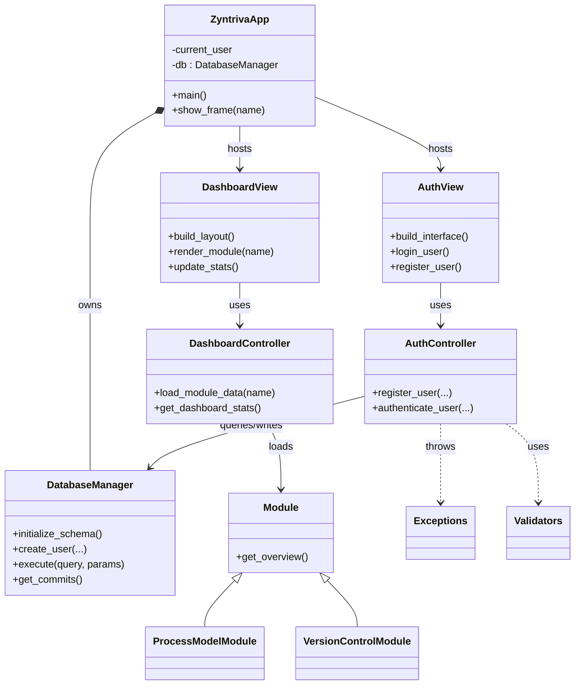
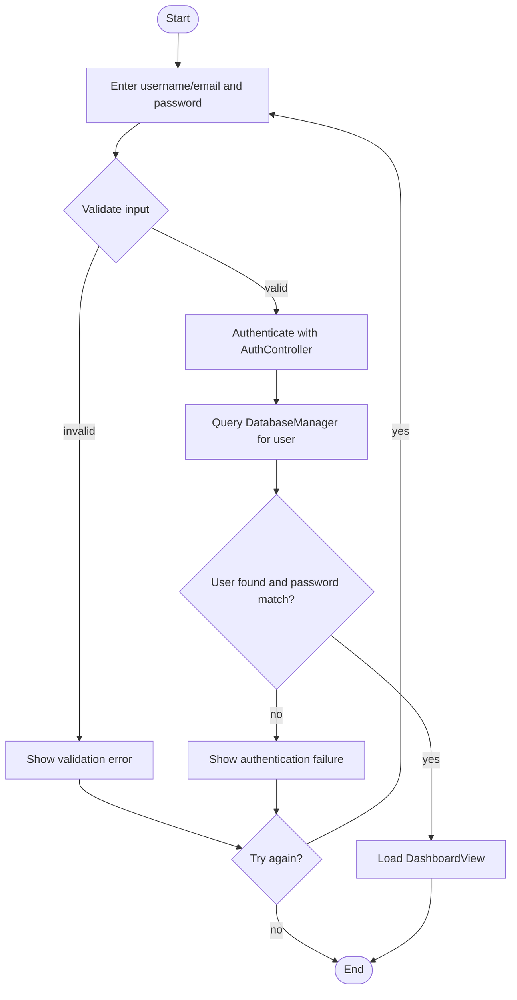
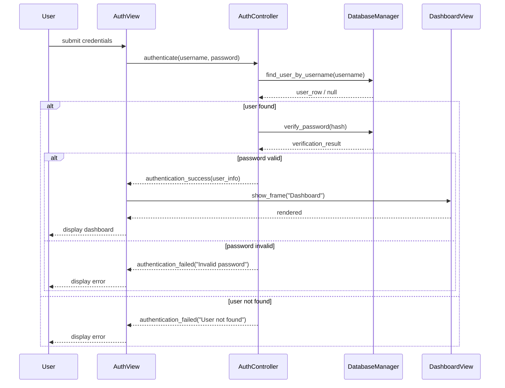

# High-Level UML Diagrams for Zyntriva

This file contains four standard UML diagrams (Use Case, Class, Activity, Sequence) in Mermaid syntax. Paste into any Mermaid renderer or Markdown preview that supports Mermaid.

Generated PNG versions are available in:

- `docs/uml_use_case.png`
- `docs/uml_class_diagram.png`
- `docs/uml_activity_diagram.png`
- `docs/uml_sequence_diagram.png`


## 1) Use Case Diagram
```mermaid
usecaseDiagram
actor User
actor Admin
User --> (Register / Login)
User --> (View Dashboard)
User --> (Attempt Problem)
User --> (Run Tests)
User --> (Participate in Peer Review)
User --> (View Reports)
Admin --> (Manage Problems)
Admin --> (Seed Data)
Admin --> (Deploy Application)
(Manage Problems) ..> (View Dashboard) : <<include>>
(Seed Data) ..> (Manage Problems) : <<extend>>
```

## 2) Class Diagram


## 3) Activity Diagram (Login flow)


## 4) Sequence Diagram (Login)

