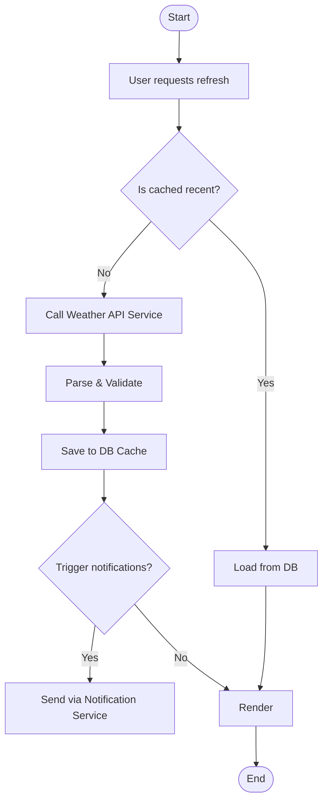

```mermaid
flowchart TD
    Start([Start]) --> UserAction[User requests refresh]
    UserAction --> CheckCache{Is cached recent?}
    CheckCache -->|No| CallAPI[Call Weather API Service]
    CallAPI --> Parse[Parse & Validate]
    Parse --> SaveDB[Save to DB Cache]
    SaveDB --> Notify{Trigger notifications?}
    Notify -->|Yes| SendNotif[Send via Notification Service]
    Notify -->|No| Render
    Render --> End([End])
    CheckCache -->|Yes| LoadCache[Load from DB]
    LoadCache --> Render
```