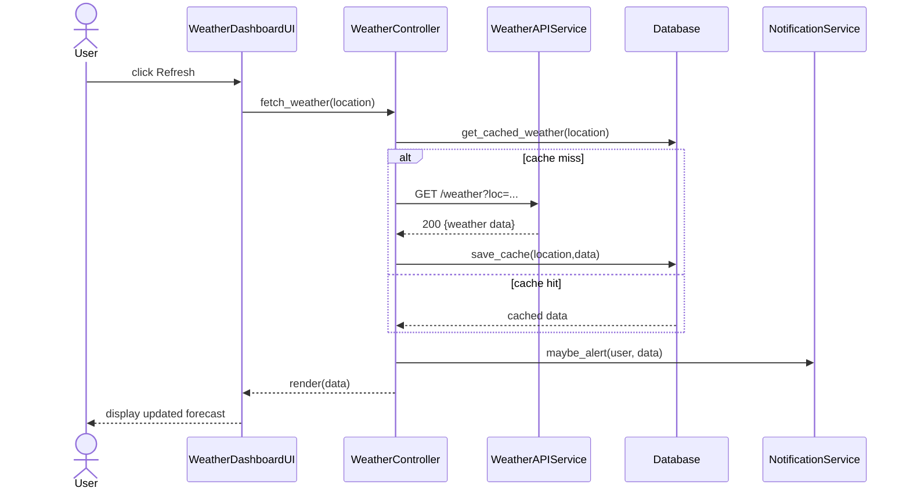

```mermaid
sequenceDiagram
    actor User
    participant UI as WeatherDashboardUI
    participant Controller as WeatherController
    participant API as WeatherAPIService
    participant DB as Database
    participant Notification as NotificationService

    User->>UI: click Refresh
    UI->>Controller: fetch_weather(location)
    Controller->>DB: get_cached_weather(location)
    alt cache miss
        Controller->>API: GET /weather?loc=...
        API-->>Controller: 200 {weather data}
        Controller->>DB: save_cache(location,data)
    else cache hit
        DB-->>Controller: cached data
    end
    Controller->>Notification: maybe_alert(user, data)
    Controller-->>UI: render(data)
    UI-->>User: display updated forecast
```